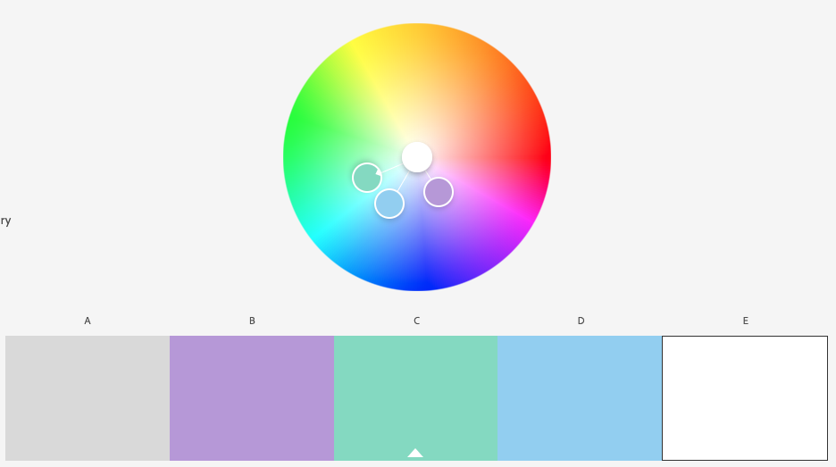

Assignment 1 - Hello World: Basic Deployment w/ Git, GitHub, Glitch
===

Sam Moran
https://a1-sdmoran.glitch.me/

This project is a basic webpage served via Node that shows an understanding of basic HTML and CSS as well as some
JavaScript.

## Technical Achievements
- **Styled page with CSS**: Added rules for selectors containing text to style them with the font
I chose to use (Noto Sans JP). Also added rules for the "intro", "coop" and "courses" ids to set
their background colors to the ones from my color palette in order to add emphasis. Finally, I
added a selector for the "rounded" class to give each section with a different background color
a smoother look. Style rules are in style.css.
- **Served separate stylesheet**: In order to keep my CSS organized, I placed it inside of a separate stylesheet. I modified ```server.js``` to server this file so that it works properly on Glitch.
- **Added JavaScript animation**: At the bottom of my webpage, there are 3 sliders corresponding to
the red, green, and blue values of the background color of my webpage. The user can change the
value of any of these sliders to change the background color. The current RGB value of the background
is displayed below the sliders, and updates when the sliders move. I also added a button to allow the
user to reset the background color to the original default values.
- **Extra Tags**: In addition to the tags covered in lecture, I made use of a table, an unordered list, a div (not sure if that counts), a horizontal rule, several inputs, and a button.

## Design Achievements
- **Used the Noto Sans JP from Google Fonts**: I used Noto Sans JP as the font for my website.
- **Created and used color palette**: I used a color palette I generated from color.adobe.com for the background of different
sections to add emphasis. The image below is a screenshot of the palette:



