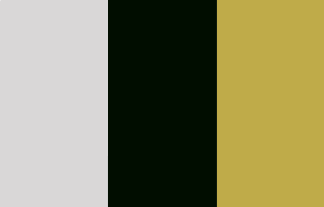

Robear Mankaryous
http://a1-rmanky.glitch.me

## Technical Achievements
**Styled page with CSS**
- Used `background-size: cover` to display background gif
- Centered name in header (with a flex-box) with accent background
- Used flex-box to position elements dynamically if window is half sized
- Used `border-collapse: collapse;` to create a single border around the table
- Colored various headers and text with foreground and accent colors

**Used other HTML tags**
- Added a `table` element to view skills and corresponding skill levels

**Modified Node Server**
- Made changes to Node JS Server to serve up CSS and background GIF

**ThreeJS**
- After taking Computer Graphics last term, I decided to throw in ThreeJS to display a little spinning 3D Cube
- *Will probably expand this more in future projects, was just a test of lighting, etc. for now*

## Design Achievements
**Used the Syne Font from Google Fonts**
- Implemented the Syne Font from Google Fonts, found below:
- https://fonts.google.com/specimen/Syne?sidebar.open=true&selection.family=Syne

**Created a Color Pallete using Adobe Color**
- Created a Color Pallete to match the nature theme of the website

