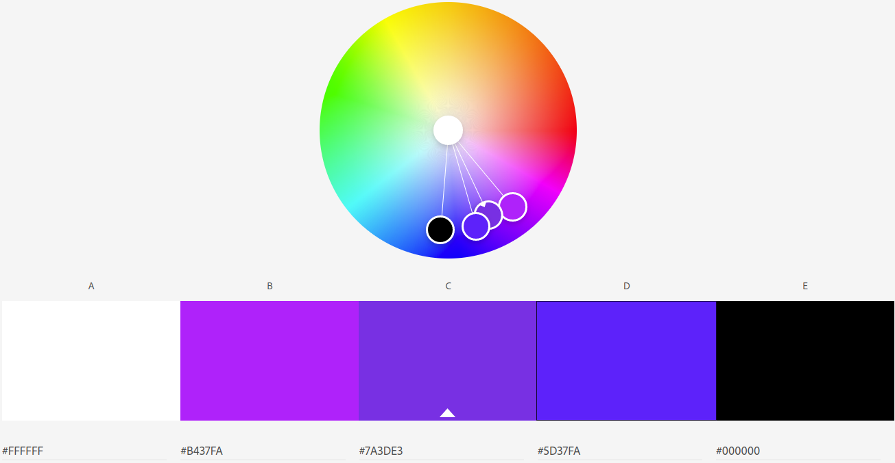

Readme
---

Pinhan Zhao
http://a1-zphw.glitch.me

This project shows my sample personal webpage.

### Technical Achievements
- **Styled page with CSS**: Added rules for the h1, a, a:hover, mode switcher, and dl\dt... Changed colors for h1, a, a:hover, and made the mode switcher floating. Also changed font size for dl and dt.
- **Added JS animation**: Animation for light/dark mode switch
- **Other HTML tags**: Added links(a), h1, h2, button, div, blockquote, strong HTML tags.

### Design Achievements
- **Color palette using color.adobe.com**: Colors in the palette are used.

- **Used the Roboto Font from Google Fonts**: Roboto Mono used as the font for the primary copy text in my site.

