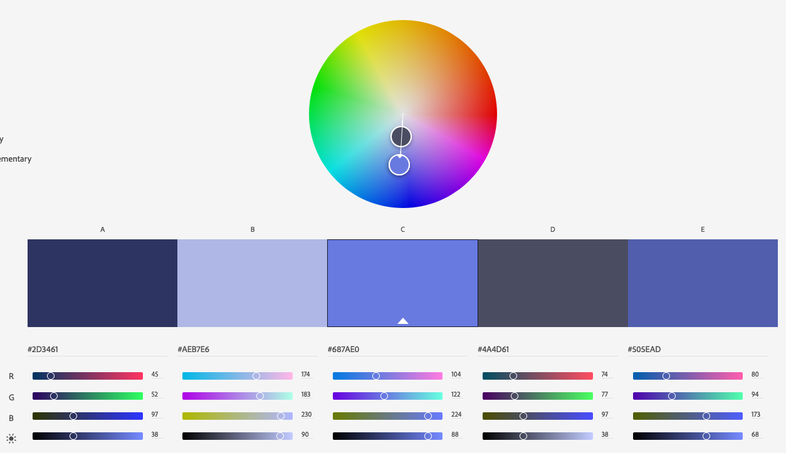

# CS 4241 Webware Assignment 1 - Matthew St Louis

Matthew St Louis  
http://a1-mastlouis.glitch.me

For me, this project is a warmup for using HTML, CSS, and JavaScript without Angular to hold them together. There are plenty of interesting features in each language that I am unfamiliar with, and this is a start toward learning some of them. This is also my first experience writing servers.

I incorporated the styles and scripts into the HTML document to simplify development, and I plan to split them up in later projects

## Technical Achievements

### Styles
Beyond the color I used for other achievements, I used some styles to improve the aesthetic appearance of my webpage.
- __Width__: I halved the width of the div I used to contain the page to narrow the lines of text to make the site more readable.
- __Margin__: I set the margin of the content div to _auto_ so that the div and its content would be in the center of the page. This has a much more natural feel than having all of the text against the left side of the page.
- __Padding__: I used 0.8em of padding on the button to give the text some room to breathe and to better show off the button's rounded edges.
- __Border__: I gave the button in the upper right of the page a 1 pixel solid purple (`#4A4D61`) border.
- __Border-Radius__: I gave the button a 15px border radius to smooth the corners.
- __Position__: I gave the button a fixed position on the screen so that the user can easily find how to stop the text from repeatedly turning green.
- __Right__: I gave the button a bit of space from the right side of the page.
- __Top__: I gave the button a bit of space from the top of the page.
- __Text-Align__: I aligned the table headings to the left so that they would not float awkwardly above the middle of the text with no apparent relative alignment.

### Animation
I added a JavaScript animation to the page where the text periodically resets to near-black and slowly turns green. This animation is triggered by the "Animate Text"/"Disable Animation" button in the upper right of the page. The button's text changes depending on whether or not the animation is currently playing.

The function to toggle the animation will either enable the animation if it is disabled or disable it otherwise. To enable the animation, it sets an interval of 100ms on a function to update the color of the body text by adding 8 to the green decimal RBG value. To disable the animation, it clears the set interval and resets the body text to its original color.

My implementation of this took a slight initialization: I need to set the color of the body manually through a script, which I accomplish at the bottom of the body. (It is done at the bottom of the body because `getElementById()` will only work if the element has been loaded.)

### Tags
I incorporated additional elements into my site, some of which I have used before and some of which I have not.
- __Anchor__: I used two _anchor_ tags: one for the text "Worcester Polytechnic Institute" and one for the text "World Championship Russian Roulette." Each of these anchor tags opens in a new page.
- __Button__: I used a _button_ to control the start and stop of the JavaScript animation. The button is in the upper right corner of the screen.
- __Strong__: I used a _strong_ element to emphasize the name of Worcester Polytechnic Institute.
- __Emphasis__: I used an _emphasis_ element to emphasize my desired profession, software engineering.
- __Table__: I created a _table_ to make my proficiencies more readable and organized.
  - __Table Row__: Each row of my table is in a _table row_ element
  - __Table Head__: I used two _table head_ elements at the top of my proficiencies table
  - __Table Data__: Each cell of the table except the header cells is in a _table data_ element.
- __Div__: I used a div to wrap the content in a container so I could center it on the page.

## Design Achievements

### Color
To theme my website, I used the Adobe Color Wheel. I picked an arbitrary primary color (`#687AE0`) as the base color and used the colors recommended off of that one.

I gave the site a bit of variety within the monochrome by coloring h3 headings differently from h1 and h2 and by giving anchors and buttons different color schemes when hovered over. Every color I used is one of the five from the Adobe Color Wheel.

### Font
All of the fonts I used are from Google Fonts. The font for all headings is [Raleway](https://fonts.google.com/specimen/Raleway) and the font for all other text is [Quicksand](https://fonts.google.com/specimen/Quicksand).

## Resources Used
I used a few external references for technical details and syntax. I've commented these in the code and will also summarize them here.
- [OnClick](https://www.w3schools.com/jsref/event_onclick.asp): I used W3Schools to remember how to apply a function on the click of a button. I used this to tie the function to toggle the animation to the corresponding button.
- [Change CSS in JS](https://www.w3schools.com/js/js_htmldom_css.asp): I used W3Schools to remember the syntax for changing an element's style with JavaScript.
- [ParseInt](https://www.w3schools.com/jsref/jsref_parseInt.asp): I used W3Schools to remember the name of the function to parse a string into a number.
- [Button Borders](https://www.w3schools.com/CSSref/css3_pr_border-radius.asp): I used W3Schools to remember how to style the border of a button in CSS.
