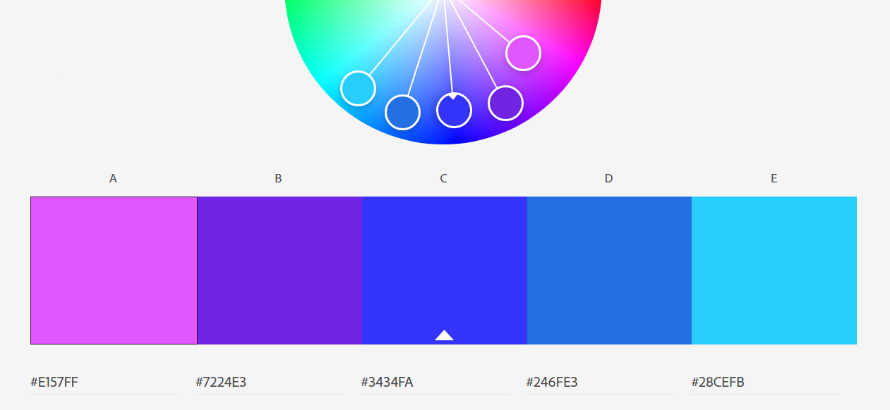

Assignment 1 - Hello World: Basic Deployment w/ Git, GitHub, Glitch
===

*DUE: Monday, September 7th by 11:59 AM (before the start of class!)*  

---

Abhijay Thammana
http://a1-charlieroberts.glitch.me

This project shows ...

## Technical Achievements
- **Styled page with CSS**: Added a background color for the header and the main part of the website from the color palette, changed the font size to be consistent throught the body tag (22px), for the header added a border, changed the text color to white, and the header background color, changed the cursor to a pointer for the hover of clickable things, manually set the width and height of some elements, set the course element to be displayed inline with a 0 margin

- **Javascript Animation**: I added one where if you click the play button next to courses it will scroll through all of the cs courses I have taken, and I kind of added another? I'm not sure this one counts, thats why I have 2, but if click on the companies I have worked on previously it changes them to a random from the list in the script tag.

- **Other HTML Tags**: I used a button tag for scrolling through my classes. I used ul for the list of work places. I used li for each work place. I used br a lot to keep small line breaks. I used a couple different h2/5 tags to experiment with the different font types. I used an iframe to add an autoplaying youtube video because everybody loves cats.

### Design Achievements
- **Color Palette**: I created a color palette with a lot of purple on the adobe site. These are the colors I got:

    

  -  `#E157FF`
  -  `#7224E3`
  -  `#3434FA`
  -  `#246FE3`
  -  `#28CEFB`

- **Used the Roboto Font from Google Fonts**: I used Roboto as the font for the primary copy text in my site. (I actually did)

